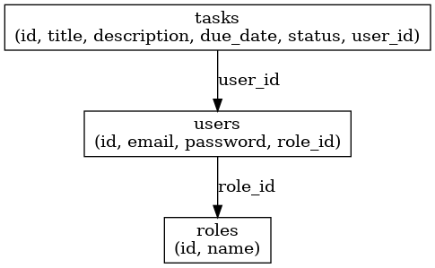

# Task Management Application Structure

# Environment vars

This project uses the following environment variables:

| Name                | Description                                         | Default Value               |
| ------------------- | --------------------------------------------------- | --------------------------- |
| PORT                | Custom port that the application will be running on | 3000                        |
| SERVICE_NAME        | The name of the current service                     | Task Management Application |
| BASE_URL            | Project base url                                    | /api/v1                     |
| DEFAULT_PAGE_SIZE   | Default page size for the pagination                | 10                          |
| DEFAULT_PAGE_NUMBER | Default page number for the pagination              | 1                           |
| NODE_ENV            | Current environment                                 | dev                         |
| DB_TYPE             | Database type                                       | mysql                       |
| DB_HOST             | Database server host                                | localhost                   |
| DB_PORT             | Database port                                       | 3306                        |
| DB_USERNAME         | Database username                                   | root                        |
| DB_PASSWORD         | Database password                                   | password                    |
| DB_INSTANCE         | Database name                                       | task_management_db          |

# Pre-requisites [Development]

- Install [Node.js](https://nodejs.org/en/)
- Install typorm globally

```
npm install typeorm -g --save
```

# Getting started

- Clone the repository

```
https://github.com/mina79/task-management-api.git
```

- Install dependencies

```
cd task-management-api
npm install
```

- Create empty database on mysql called **task_management_db**

```
CREATE DATABASE task_management_db;
```

- **IMPORTANT!** Read **jwt_token_sign_and_verify_configs.md** file to add key files

- Applying DB migrations

```
npm run migration:run
```

- Build and run the project (development)

```
npm run start
```

- Run unit tests

```
npm run test
```

- Build and run the project using **docker**

```
docker-compose build
docker-compose up
```

Navigate to `http://localhost:3000`

- Testing the application

```
      http://localhost:3000/api/v1/misc/ping
      Expected Response:
      "PONG !! from Task Management - Sun Sept 14 2024 20:06:13 GMT+0300 (Eastern European Standard Time)"
```

### How to Use Swagger Documentation

1. **Open Swagger UI**: Navigate to `http://localhost:3000/docs` in your browser.

2. **Explore Endpoints**: The Swagger UI will display a list of available API endpoints organized by tags (e.g., Users, Tasks). Click on any endpoint to expand it and view more details.

3. **Try Out Endpoints**: For each endpoint, you can:

   - View the required parameters and request body.
   - Send a request directly from Swagger UI by providing the necessary data and clicking the "Try it out" button.
   - See the response status, headers, and body.

4. **View Response Details**: After sending a request, Swagger will show you the response data, including any error messages, response codes, and the structure of the returned data.

## Project Structure

The folder structure of this app is explained below:

| Name                       | Description                                                           |
| -------------------------- | --------------------------------------------------------------------- |
| **node_modules**           | Contains all npm dependencies                                         |
| **src**                    | Contains source code that will be compiled to the dist dir            |
| **tests**                  | Contains the projects tests                                           |
| **src/config**             | Contains project configurations i.e. database connection & migrations |
| **src/domains**            | Contains the project domains (features)                               |
| **src/routes**             | Contain all express routes                                            |
| **src**/server.js          | node js server configurations                                         |
| **src**/app.js             | Entry point to express app                                            |
| dockerfile.be              | backend docker image                                                  |
| dockerfile.postgres        | database docker image                                                 |
| docker-compose.yml         | docker compose file                                                   |
| package.json               | Contains npm dependencies as well as build scripts                    |
| .env.local                 | environment file                                                      |
| config.ts                  | project configurations module                                         |
| task_management_schema.sql | database schema                                                       |

## Database ERD

Database ERD for the task management system, including the users, roles, and tasks tables. This schema is designed to support the user-task relationship, where users can create and manage their tasks, and each user has a specific role


